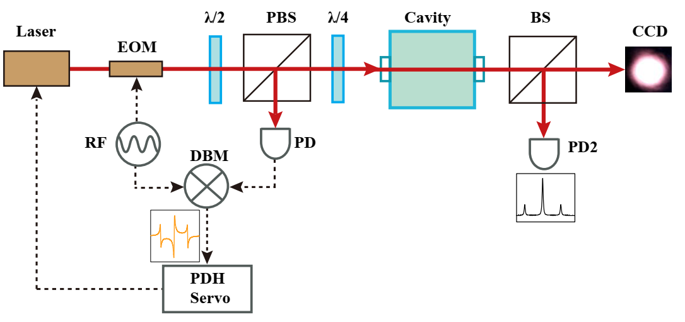
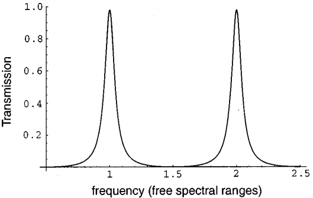
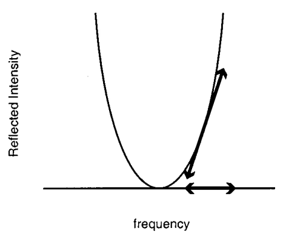
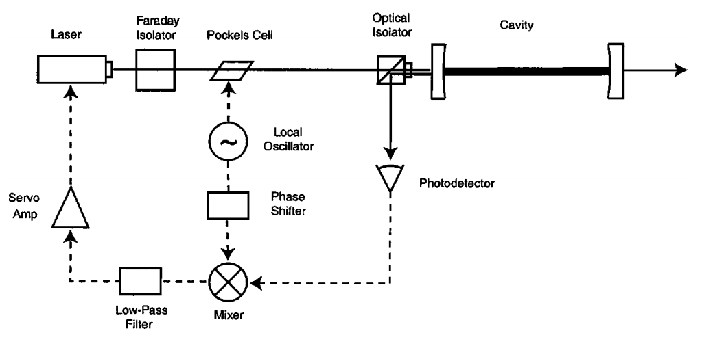
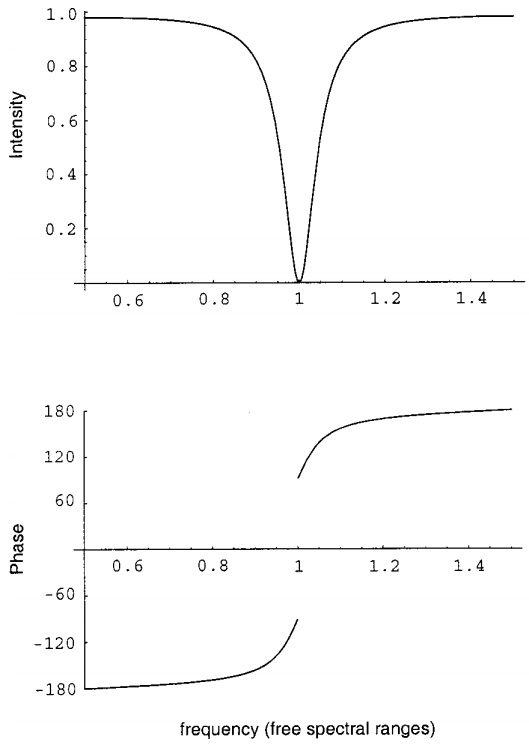
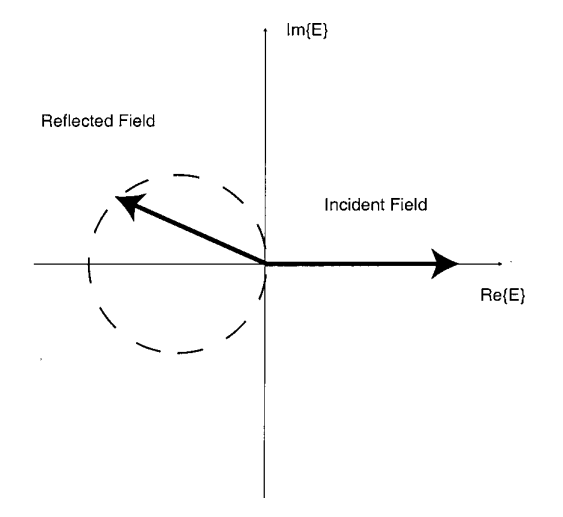
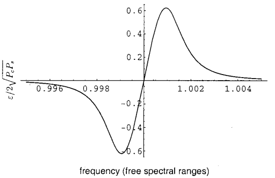
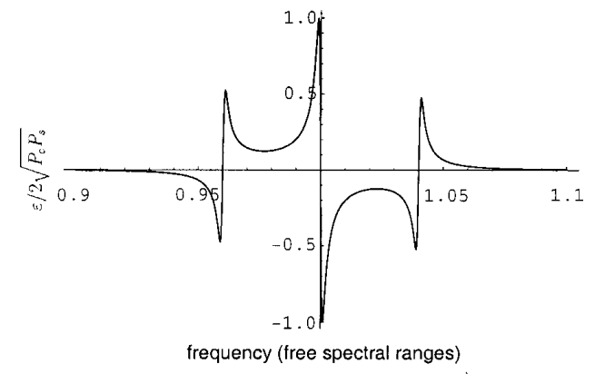
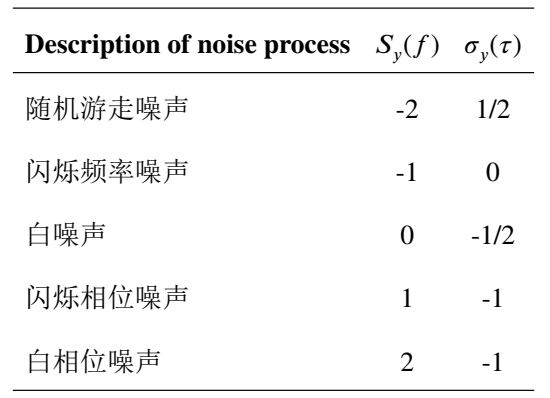

## 毕设（基于Mini-FP腔的PDH激光稳频技术研究）

三部分工作：**腔体封装、激光稳频系统搭建和噪声分析**

实现框图：(棱镜用于维持光路单向性，EOM用于调制，PD用于光电信号转换)

### 有关的物理概念

- 频率稳定度：反映特定时间范围内信号源的频率波动程度。

### PDH稳频技术模型

#### 1.PDH稳频技术诞生之前的稳频技术

- 实现手段：直接将光束注入FP腔体，观察**透射光强度**

- 实现细节：

  - 腔体的自由光谱范围（FSR，Free Spectral Range）：当激光频率为**c/2L的整数倍**时，光和腔体达到共振，这个频率范围即为**FSR**
  - 透射系数和频率的关系（**频域传输函数**）：

  

- 缺点：系统无法识别激光本身的频率波动和光强波动导致的透射系数变化。

#### 2.改进思路：用**反射光零点**代替透射系数作为频率响应

- 两种噪声的解耦：

  - 频率噪声：频率在共振频率附近的偏移使得反射光强**对称式上升**
  - 强度噪声：使得不同频率的反射光强整体按**同比例变化**
  - 维持反射光零点能消除强度噪声带来的影响，使其只受频率噪声的影响

- 误差信号的选择：

  - 反射光的频率响应：

  

  - 利用该频率响应的导数在频域上的**反对称**性，在调整频率时根据反射光强的变化即可知道此频率点位于共振频率的哪一侧。

#### 3. PDH稳频技术实现原理

##### 3.1 实现框图及组件作用

- 各个组件的作用：

Faraday Isolator：隔离作用，维持光路单向性，保护激光器。

Pockels Cell：电光调制器，由本地振荡器驱动，对激光进行**相位调制**。

Local Oscillator：本地振荡器，产生对应调制频率的信号。

Optical Isolator：选择偏振状态，维持光路单向性。

Cavity：Mini-FP腔，决定共振频率，反射光由**及时反射光束（Promptly Reflected Beam）**和**泄露光束（Leakage Beam）**组成。

Photodetecter：光电转换器，将反射光转化为电信号。

Mixer：混频器，用于解调。

Phase Shifter：移相器，用于解调信号的相位补偿。

Low-Pass Filter：低通滤波器，滤掉混频器输出端的和频信号，保留差频信号，差频信号即为误差信号。

Servo Amp：伺服放大器，放大误差信号并反馈至激光器的调频端，以形成对频率的闭环控制。

##### 3.2 FP腔体的频域特性

###### 3.2.1 传输函数

设$r$为光从真空射向腔体的幅度反射系数，$\bigtriangleup \nu_{fsr}$为腔体的FSR（c/2L），则腔体反射光的传输函数为：

$F(\omega)=E_{\mathrm{ref}} / E_{\mathrm{inc}}=\frac{r\left(\exp \left(i \frac{\omega}{\Delta \nu_{\mathrm{fsr}}}\right)-1\right)}{1-r^{2} \exp \left(i \frac{\omega}{\Delta \nu_{\mathrm{fsr}}}\right)}$

功率传输函数为：

$P(\omega)={\left | F(\omega) \right |}^2$

在后续的方案中，将会对$F(\omega)$做不同的近似处理。

###### 3.2.2 频域响应

可见，当输入频率刚好为共振频率时，反射光和入射光相位差180°。

若输入频率和共振频率有偏差，从相位响应可以判断输入频率位于共振频率哪一侧。

###### 3.2.3 F($\omega$)在复平面的示意图

结合幅度响应和相位响应可以得到入射场和反射场在复平面的示意图。

在一个频率周期内，随着频率$\omega$的增大，**反射场矢量逆时针旋转**，终点轨迹是一个圆心位于实轴的圆。当频率为共振频率时，反射场位于实轴。

##### 3.3 相位信息获取：调制与解调

由上述分析，激光频率的偏移量和偏移方向信息需要从反射光相位中获取。

测量光波的电场相位十分困难，需要间接测量。

采用**相位调制（PM）的好处**：复杂度更低，相对于FM更适合Pockels Cell调制。

###### 3.3.1 时域调制信号

时域调制信号为：

$E_{\mathrm{inc}}=E_{0} e^{i(\omega t+\beta \sin \Omega t)}$

其中$\beta$为调制深度，要使得功率主要分布在主频和一阶边带上，需要$\beta<1$。

###### 3.3.2 低频调制方案

若采取低频调制（即调制频率满足$\Omega \ll \Delta \nu_{\mathrm{fsr}} / \mathcal{F}$，其中$\mathcal{F}$是腔体的品质因数），这样边带处频率点的反射光功率即可用**主频处功率传输函数的微分近似**。

数学表达式为：

$P_{\mathrm{ref}}(\omega+\Omega\beta\cos\Omega t) & \approx P_{\mathrm{ref}}(\omega)+\frac{dP_{\mathrm{ref}}}{d\omega}\Omega\beta\cos\Omega t \\
 & \approx P_{\mathrm{ref}}(\omega)+P_{0}\frac{d|F|^{2}}{d\omega}\Omega\beta\cos\Omega t$

反射光由主频、上边带、下边带三者的干涉组成，因此反射光的频率成分有：主频$\omega$（及其边带）附近、$\Omega$附近、$2\Omega$附近，通过低通滤波器后获取$\Omega$附近的频率成分。

此时反射光功率：（其中信号送入混频器之前**只保留$\Omega$频率**附近的成分）

$P_{\mathrm{ref}}  \approx(\text{ constant terms})+P_{0}\frac{d|F|^{2}}{d\omega}\Omega\beta\cos\Omega t  +(2\Omega\mathrm{terms})$

设$P_c$和$P_s$分别为主频和边带的功率，做进一步近似，可得误差信号表达式：

$\epsilon=P_0\frac{d|F|^2}{d\omega}\Omega\beta\approx2\sqrt{P_cP_s}\frac{d|F|^2}{d\omega}\Omega$

误差信号和频率之间的关系图为：（调制频率取1/1000倍的FSR，精细度500）

###### 3.3.3 高频调制方案

若采用高频调制，边带频率远离共振频率，**可以近似认为无透射光**，即$F(\omega \pm \Omega)=-1$

此时$F(\omega)$为：（$\delta \omega$为频率偏移量，$\delta \nu=\Delta \nu_{fsr}/ \mathcal{F}$为腔体线宽）

$F\approx\frac{i}{\pi}\frac{\delta\omega}{\delta\nu}$

误差信号为：

$\epsilon\approx-\frac{4}{\pi}\sqrt{P_{c}P_{s}}\frac{\delta\omega}{\delta\nu}$

若激光频率接近共振频率，则误差信号和频率偏移量具有**良好的线性关系**。选取调制频率为20倍FSR，精细度500，误差信号的频谱：

可见精细度非常高，且充分利用相位线性区，因此**PDH技术主要采用高频调制方案**。

###### 3.3.4 两种调制方案对比

- 复平面矢量模型对比：

低频调制：边带矢量在复平面缓慢旋转，和载波形成**动态干涉**。

高频调制：边带矢量快速旋转，微弱的载波反射光打破边带矢量的对称性，使其呈现**微小的相位差**，反射光产生$\Omega$分量。

- 物理机制对比：

低频调制：边带部分透射进入腔体，腔体也会响应边带。

高频调制：边带远离腔体共振频率，几乎被完全反射，**边带和载波解耦**。

- 误差信号对比：

低频调制：由余弦项主导，载波和边带动态干涉，主要反映载波和边带的**振幅干涉**。

高频调制：由正弦项主导，反映载波通过腔体产生的**微小相位差**，线性度好。

- 性能对比：

低频调制：信号产生简单，延迟高，**灵敏度低，易受低频噪声（如强度噪声）影响**。

高频调制：复杂度高，**灵敏度高，易受高频噪声影响**。

- 噪声来源：激光强度噪声（低频噪声）、激光本身频率的随机漂移、**腔长变化引起的噪声**、电子器件本身的噪声。

###### 3.3.5 提高误差信号斜率的方法

由式子$\epsilon\approx-\frac{4}{\pi}\sqrt{P_{c}P_{s}}\frac{\delta\omega}{\delta\nu}$可知，提高误差信号斜率的方案：**激光功率、相位调制深度和参考腔线宽**。由于功率、调制深度的改变会影响系统其它组件，因此提高误差信号斜率的最佳办法是**使用高精细度、窄线宽的参考腔，使用高反射率、低损耗的腔镜**。

### Mini-FP腔的封装

#### 几个常识性问题

- 超窄线宽激光的用途：产生或者传递高精度的时间频率信号。
- 激光稳频的两个指标：**线宽和频率稳定度**。
- **超稳光学参考腔的共振频率**作为激光稳频系统的频率参考。
- 光学腔体的噪声：频率稳定度取决于**腔长的稳定度**，使用**热屏蔽层**阻隔热交换。
- 噪声隔离：**隔温**（将腔体温度控制在零膨胀点附近）和**隔振**封装（主动减振和被动减振）。最终腔长稳定度取决于**热噪声极限**。
- 使用材料：腔体ULE（超低热膨胀系数玻璃，Ultra-low Expansion），腔镜ULE或者FS（熔融石英，Fused silica）。FS：低机械损耗，高热膨胀系数。解决办法：温度补偿，在FS腔镜背面再粘ULE圆环。
- 腔体热噪声来源：腔镜及其镀膜材料。
- 高反射率腔镜采用SiO2/Ta2O5为镀膜材料、用离子溅射工艺。

#### 封装材料特性

#### 温控系统

#### 隔振方式

#### 封装结构

### 噪声分析：激光噪声表征和测量

#### 1.噪声表征手段

##### 1.1 时域表征

- 测量基准：信号的功率，以一段时间的功率平均值作为基准。

- 用标准样本方差的缺点：有低频1/f闪烁噪声和突变噪声。

- 用**阿伦方差**(Allan Varian)：$\sigma_y^2\left(\tau\right)=\frac{1}{2\left(N-1\right)}\sum_i\left(y_{i+1}-y_i\right)^2$在时域上表示噪声。

- 和标准方差的区别：取相邻时刻的功率值，很大程度上避免了**突变噪声**带来的不准确性。但是对真实的噪声结构描述的仍然不理想。

##### 1.2 频域表征

激光器：$E\left(t\right)=E_0\cos(\omega_0t+\phi_0),\omega_0=2\pi f_0$

会产生**强度噪声、频率噪声和相位噪声**。

频域主要用功率谱密度(PSD)表示，即将激光器的噪声看做随机过程，对其自相关函数做傅里叶变换即可得到PSD。

时间频率领域通常会研究五种噪声：**随机游走噪声、闪烁频率噪声、白噪声、闪烁相位噪声和白相位噪声**。

可以用频率的不同幂次的谱密度表示这五种噪声：

$S_y(f)=
\begin{cases}
\sum_{\alpha=-2}^{+2}h_\alpha f^\alpha & 0<f<f_h \\
 \\
0 & f\geq f_h & 
\end{cases}$

对应的频率幂次和阿伦方差幂次：

可通过Allan Deviation图中的**斜率**确定各个频段的噪声类型，以便于抑制对应的噪声。

#### 2.相位噪声

相位噪声分为频率**短期稳定度**和长期稳定度，对激光器考虑前者。

相位噪声的表示：**相位波动功率谱密度**和**单边带相位噪声**。

- 相位波动功率谱：偏离载频处，单位带宽的相位起伏，采用单边带定义。但是噪声对于激光的影响表现为调制作用，即在载频的附近产生对称的边带，需要把负频率对称到正频率上。（单位：rad/√Hz）
- 单边带相位噪声：偏离载波频率某频率处，1Hz带宽内的信号功率和载波功率之比。（单位：dBc/Hz）

相位噪声表征单频信号频率稳定度，在频域上表现为噪声边带。相位波动功率谱是单边带相位噪声的两倍。

#### 3. 频率噪声

频率噪声描述振荡信号瞬时频率的随机涨落，频率噪声和相位噪声（功率谱）的关系：

$S_{\nu}\left(f\right)=f^{2}S_{\varphi}\left(f\right)$

频率噪声在时域上可用阿伦方差表示，但更多地用较长时间内的频率稳定度（频率漂移）表示。

单频激光器的频率噪声用频率波动谱密度表示：偏移载频的某频率处单位带宽内，频率波动谱密度的均方值，单位为${Hz}^2/Hz$。

